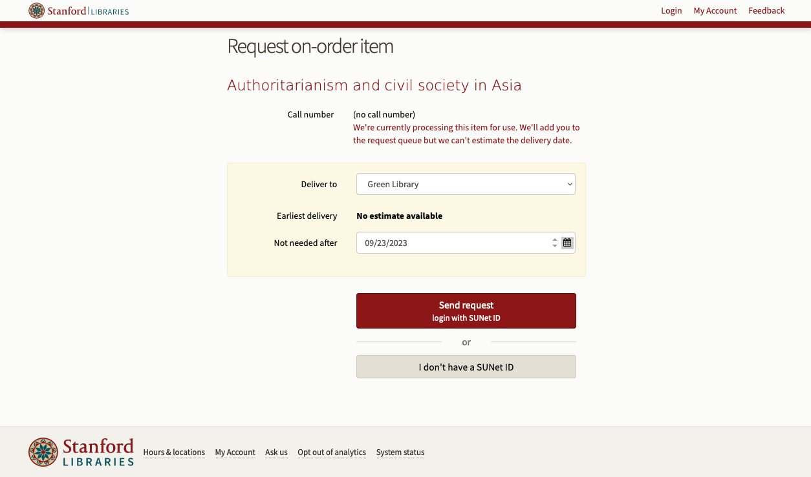

# sul-requests
[](https://github.com/sul-dlss/sul-requests/releases)
[](https://opensource.org/licenses/Apache-2.0)

<p align="center">a rails application for requesting materials from the Stanford University Library.</p>


## features
- request all materials from a single online form, regardless of home location.
- support Scan & Deliver service for limited materials.
- provide support for the Special Collections request process.
- avoid known usability/accessibility issues with third-party request forms.
- support administrative tasks, including request mediation, updating the paging schedule, and adding/removing requestable item categories.
- provides a mechanism for the general public (without an ILS account) to request items with just name and email, specifically to support government documents.
## local development
### requirements
- Ruby (tested on 3.0)
- Rails (tested on 6.1)
- a database (tested on sqlite3)
## setup
clone the repository:
```sh
git clone git@github.com:sul-dlss/sul-requests.git
```
install dependencies:
```sh
bundle install
```
run database migrations:
```
bin/rails db:migrate
```
run a development server:
```
REMOTE_USER=yoursunetid bin/dev
```
## configuration
configuration is handled through the [RailsConfig](/railsconfig/rails_config) settings.yml files. you can create a `config/settings/development.local.yml` file to use while developing, which will be ignored by git.
### workgroups
several settings exist that govern the relationship between user workgroups in LDAP and permissions in sul-requests.

* `super_admin_groups` is an array of LDAP workgroups that get all privileges in the application.
* `site_admin_groups` is an array of LDAP workgroups that have the ability to manage all requests and related objects in the application.
* `origin_admin_groups` has library codes configured with an array of LDAP workgroups that can manage requests originating from that library.
* `origin_location_admin_groups` has location codes configured with an array of LDAP workgroups that can manage requests originating from that location.

```
    origin_admin_groups:
      SAL-NEWARK: ['worgroup1', 'workgroup2']
```

in order to develop the application it's often necessary to fake workgroups so that we don't need a local LDAP service.

* `fake_ldap_attributes` has SUNet IDs configured with a fake LDAP WorkGroup string.

```
    fake_ldap_attributes:
      user_sunet:
        eduPersonEntitlement: 'some-set|of-workgroup-strings'
```

so your `config/settings/development.local.yml` file might look like:

```
fake_ldap_attributes:
  (your sunet id):
    eduPersonEntitlement: 'mine:mine'

super_admin_groups: ['mine:mine']
```

this will assign you the relevant LDAP attributes when you run a server using `REMOTE_USER=(your sunet id) rails s`.

### token encryption
there is a token encryption library that handles encrypting and decrypting tokens given to users who only submit a Name/Email or Library ID for identification purposes. to keep these tokens secure we require a secret and a salt configured of moderate complexity and randomness (`SecureRandom.hex(128)` can be useful). once configured, these keys (or the tokens generated in the app) **MUST NOT** change, otherwise the tokens that users have been given will no longer be valid.
## testing
the test suite (with RuboCop style enforcement) will be run with the default rake task (also run in CI):
```sh
rake
```
the tests can also be run without RuboCop enforcement:
```sh
rake spec
```
and RuboCop style enforcement can be run without running the tests:
```
rake rubocop
```

## request lifecycle
the app is structured around the core `Request` model, which may transform itself into a more specific subclass based on an applicable set of rules.

`Request`s include an instance of `RequestAbilities`, a container for various methods that support introspection about what the `Request` is for. these methods often reference `LocationRules`, a container for business logic specific to `Request`s. the main `settings.yml` has a large number of settings that set up `LocationRules` for libraries and locations across SUL.

`LocationRules` usually specify the behavior of a `Request` using a combination of several attributes. for example:
```yaml
pageable:
  - library: SAL3
    locations:
      - PAGE-EA
    item_types:
      - LCKSTK
    aeon: true
    aeon_site: EASTASIA
```
this rule specifies that an item originating from offsite storage at SAL3 with a location of PAGE-EA and an item type of LCKSTK can be paged. the `aeon` and `aeon_site` attributes are used to specify that the request should be sent to Aeon for processing, with the `aeon_site` attribute specifying which reading room the item will ultimately be delivered to for the patron to access.

all `Request`s are initially submitted using the same route, but the controller will transform the `Request` into a more specific subclass based on its `RequestAbilities` using `Request#delegate_request!`, handing off the request for further processing. in the example above, the `Request` would become an `AeonPage` as a result of the applicable `LocationRule`.

`Request`s begin life with a small amount of information about their subject, provided through query parameters: `item_id`, `origin`, and `origin_location`. the `Request` is equipped to look up more information by querying services like the ILS and SearchWorks through various API wrappers (see e.g. `app/models/searchworks_item.rb`). SearchWorks in particular can [respond with JSON](https://searchworks.stanford.edu/view/11548957/availability.json) that lists the holdings for an item, which are used to power the item selector interface so that patrons can choose which items they want to request when multiple options are available.
## making requests in development
### finding a record
1. start by looking at the settings governing location rules for the request you want to create. for example, if you're creating a `MediatedPage`, you'll want to find a location/library stanza under `pageable` with `mediated: true`.
2. you can use SearchWorks to find a record that matches the configuration you're looking for. you can facet using the "Library" facet in combination with "At the library" in the "Access" facet to limit your results.
3. if you need to get more granular, you can visit the production solr web interface and query for a particular library/location/item type combination in the `q` field using the `building_location_facet_ssim` facet. for example: `building_location_facet_ssim:SAL3/PAGE-EA/*` for library and location, or `building_location_facet_ssim:SAL3/PAGE-EA/type/NEWSPAPER` for all three.
4. obtain the catkey for the record, which is the last part of the URL in searchworks (e.g. https://searchworks.stanford.edu/view/14136534) or the `id` value in solr.
5. navigate to your running development instance and append the catkey to the end of the URL as a parameter, along with the origin library and location. for example: http://localhost:3000/requests/new?item_id=14136534&origin=SAL3&origin_location=PAGE-EA
6. the request should be routed to the appropriate controller for its request type, but if not, you can instead force it to a particular path by changing the URL, e.g. http://localhost:3000/aeon_pages/new?item_id=14136534&origin=SAL3&origin_location=PAGE-EA for an `AeonPage`.
### example requests
<details>
  <summary>Pickup / scan</summary>

  - http://localhost:3000/requests/new?item_id=13331339&origin=SAL3&origin_location=STACKS
  - http://localhost:3000/requests/new?item_id=9446542&origin=SAL3&origin_location=STACKS
  - http://localhost:3000/requests/new?item_id=2028136&origin=SAL3&origin_location=PAGE-GR
</details>

<details>
  <summary>Mediated page</summary>

  - http://localhost:3000/requests/new?item_id=14218863&origin=ART&origin_location=ARTLCKL
  - http://localhost:3000/requests/new?item_id=13949001&origin=SAL3&origin_location=PAGE-MP
</details>

<details>
  <summary>Aeon</summary>

  - http://localhost:3000/requests/new?item_id=4103002&origin=SPEC-COLL&origin_location=UARCH-30 (single item)
  - http://localhost:3000/requests/new?item_id=11912879&origin=SPEC-COLL&origin_location=UARCH-30 (multiple items)
  - http://localhost:3000/requests/new?item_id=4086059&origin=SPEC-COLL&origin_location=U-ARCHIVES (finding aid)
</details>
